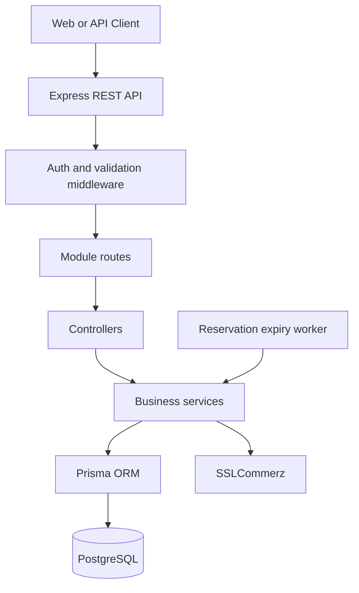
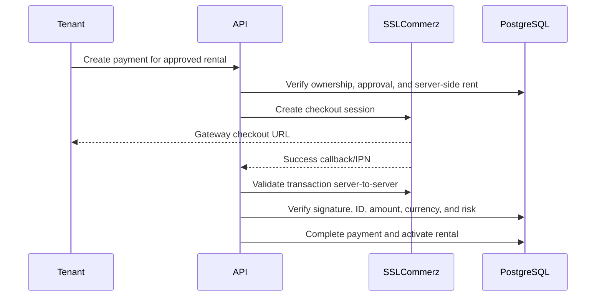

# RentNest — Rental Marketplace Backend

RentNest is a production-oriented rental marketplace API connecting tenants, landlords, and administrators through property discovery, rental approvals, verified payments, and post-rental reviews. It demonstrates secure role-based access control, concurrency-safe reservations, and a gateway-backed rental lifecycle.

> Current repository scope: backend API. No frontend application or deployment manifest is included in this repository.

## Contents

- [Project Overview](#project-overview)
- [Key Features](#key-features)
- [Technology Stack](#technology-stack)
- [Architecture](#architecture)
- [Core Workflows](#core-workflows)
  - [Rental Workflow](#rental-workflow)
  - [Payment Workflow](#payment-workflow)
  - [Reservation Expiry](#reservation-expiry)
- [Security](#security)
- [Database Design](#database-design)
- [API Overview](#api-overview)
- [Project Structure](#project-structure)
- [Getting Started](#getting-started)
  - [Prerequisites](#prerequisites)
  - [Installation](#installation)
  - [Environment Variables](#environment-variables)
  - [Database Setup](#database-setup)
  - [Development](#development)
  - [Production Build and Start](#production-build-and-start)
- [Deployment](#deployment)
- [Engineering Highlights](#engineering-highlights)
- [Challenges and Technical Decisions](#challenges-and-technical-decisions)
- [Testing](#testing)
- [Future Improvements](#future-improvements)
- [Author](#author)

## Project Overview

RentNest models the complete rental journey: landlords publish properties, tenants search and request rentals, landlords or admins approve requests, tenants complete payment through SSLCommerz, and verified rentals become active before eventually being completed. The most challenging parts are maintaining property availability under concurrent approvals, safely processing asynchronous payment callbacks, and preserving consistent rental/payment state.

## Key Features

- **Database-backed JWT authentication** — Verifies access tokens, reloads the current user from PostgreSQL, checks the current account status, and applies role-based authorization for tenants, landlords, and admins.
- **Ownership-aware authorization** — Service queries restrict landlords to their properties and tenants to their rentals, payments, and reviews; admin access is explicitly protected.
- **Concurrency-safe reservations** — Serializable Prisma transactions and conditional availability updates prevent competing approvals from reserving the same property.
- **Rental lifecycle enforcement** — Requests move through `PENDING`, `APPROVED`, `REJECTED`, `ACTIVE`, and `COMPLETED`, with verified payment required before activation and completion.
- **Secure SSLCommerz payment lifecycle** — Uses signed callbacks/IPN, server-side gateway validation, amount/currency matching, risk checks, retryable payment attempts, and idempotent state handling.
- **Reservation expiry processing** — An internal worker can expire stale unpaid approvals, cancel unfinished attempts, and release properties safely. It is currently opt-in in `src/server.ts`.
- **Property discovery API** — Supports text search, location, category, rent range, amenities, availability, sorting, pagination, and result metadata.
- **Verified reviews** — Reviews require a completed rental with completed payment, and a database composite constraint prevents duplicate tenant/property reviews.
- **Administrative moderation** — Admins can inspect users, listings, and rentals; ban or unban tenants and landlords; and manage categories while administrator status changes are blocked.
- **Data-preserving deletion rules** — Properties with rental or review history and categories used by properties cannot be deleted.

## Technology Stack

### Backend

- Node.js
- TypeScript
- Express 5
- REST API architecture

### Database and ORM

- PostgreSQL
- Prisma ORM and Prisma Client
- Prisma migrations

### Authentication and security

- JSON Web Tokens via `jsonwebtoken`
- `bcryptjs` password hashing
- HttpOnly access and refresh-token cookies
- Bearer-token support
- Role-based and ownership-based authorization
- Runtime validation middleware
- Database constraints and transactional integrity

### Payments

- SSLCommerz sandbox/production API integration
- Public success, failure, cancellation, and IPN callbacks; failure/cancellation/IPN payloads are signature-checked and successful payments are validated server-to-server with SSLCommerz

### Other tools

- `dotenv` configuration
- `cors`
- `cookie-parser`
- `pg` PostgreSQL driver

## Architecture

RentNest uses a modular Express architecture. Routes apply authentication and validation middleware, controllers handle HTTP concerns, services enforce business rules, and Prisma provides typed access to PostgreSQL.



## Core Workflows

### Rental workflow

```text
PENDING → APPROVED → ACTIVE → COMPLETED
       ↘ REJECTED
```

Landlords or admins approve or reject pending requests. Approval reserves the property and rejects other pending requests for that property. After verified payment, the request becomes active. Only an active, paid rental can be completed, after which the property can become available again.

### Payment workflow



Payment records contain a summary payment and one or more payment attempts. Older failed or cancelled attempts remain available for audit and retry handling. Success and failure processing is designed to be idempotent.

### Reservation expiry

Approved rentals receive an `approvedAt` timestamp. The expiry worker finds approved reservations older than the configured window, conditionally changes them to `REJECTED`, cancels unfinished payment attempts, cancels open payment records, and releases the property only when no other approved or active reservation owns it.

## Security

- JWT access tokens are verified before protected operations.
- The current user is loaded from PostgreSQL on every authenticated request, so banned accounts are rejected even if a token remains unexpired.
- Required roles are enforced at route boundaries.
- Resource ownership and business authorization remain enforced in services.
- Profile, password, user-status, and property payloads use runtime validation and allowlisted fields.
- Admins cannot change administrator status or ban themselves.
- Failure, cancellation, and IPN callbacks validate SSLCommerz signatures before changing state; successful callbacks trigger authoritative server-to-server gateway validation.
- Payment confirmation validates the known transaction ID, gateway status, amount, currency, and risk level.
- Passwords are stored using bcrypt hashes and secrets are read from environment variables.
- Database unique constraints protect transaction IDs and duplicate reviews.

Production deployments should use HTTPS and secure cookies; the current local configuration is intended for development and gateway testing.

## Database Design

| Entity | Purpose |
| --- | --- |
| `User` | Authentication identity, role, and active/banned status. |
| `Property` | Landlord-owned listing with category, rent, amenities, and availability. |
| `Category` | Property classification managed by administrators. |
| `RentalRequest` | Tenant request and rental lifecycle state for a property. |
| `Payment` | One payment summary associated with an approved rental request. |
| `PaymentAttempt` | Individual gateway attempt retained for retries and audit history. |
| `Review` | Tenant review tied to a property and tenant. |

Important database decisions include foreign-key relationships, cascade behavior for dependent marketplace records, the composite unique constraint on `(tenantId, propertyId)`, unique transaction IDs, and indexes on property/category/tenant ownership, rental status, approval timestamps, and payment status. Rental approval, payment completion, and expiry use database transactions to protect cross-entity consistency.

## API Overview

| Resource | Main methods | Purpose |
| --- | --- | --- |
| Authentication | `POST`, `GET` | Register, login, and retrieve the current user. |
| Users | `GET`, `PATCH` | View/update profile, change password, and manage user status as admin. |
| Properties | `GET`, `POST`, `PUT`, `PATCH`, `DELETE` | Discover listings, manage landlord-owned properties, and update availability. |
| Categories | `GET`, `POST`, `PATCH`, `DELETE` | Browse and manage property categories. |
| Rental requests | `GET`, `POST`, `PATCH` | Submit requests, view role-scoped history, approve/reject, and complete rentals. |
| Payments | `GET`, `POST` | Create checkout sessions, process callbacks, and view role-scoped payment history. |
| Reviews | `GET`, `POST`, `DELETE` | Browse reviews and create/delete authorized reviews. |
| Admin overview | `GET` | Inspect all listings and rental requests through protected admin routes. |

Primary route prefixes are `/api/auth`, `/api/users`, `/api/properties`, `/api/categories`, `/api/rental-requests`, `/api/payments`, `/api/reviews`, and `/api/admin`.

## Project Structure

```text
src/
├── config/                 Environment-backed configuration
├── errors/                 Application error type
├── jobs/                   Reservation expiry worker
├── lib/                    Prisma client setup
├── middlewares/            Authentication, validation, and error handling
├── modules/
│   ├── admin/              Protected admin overview routes
│   ├── auth/               Registration, login, and current-user access
│   ├── categories/         Category management
│   ├── payments/           SSLCommerz and payment lifecycle logic
│   ├── properties/         Listing search and landlord management
│   ├── rentalRequests/     Rental workflow and state transitions
│   ├── reviews/            Verified review logic
│   └── users/              Profiles and admin user management
├── utils/                  JWT, async handling, and response helpers
├── app.ts                  Express middleware and route registration
└── server.ts               Database connection and HTTP startup

prisma/
├── schema/                 Split Prisma schema files
└── migrations/             Versioned PostgreSQL migrations
```

## Getting Started

### Prerequisites

- Node.js with npm
- PostgreSQL database
- SSLCommerz credentials for payment testing or production callbacks

### Installation

```bash
npm install
npx prisma generate
```

### Environment variables

Create a `.env` file with the following variable names. Do not commit real credentials.

```env
PORT=
DATABASE_URL=
APP_URL=
BCRYPT_SALT_ROUNDS=
JWT_ACCESS_SECRET=
JWT_REFRESH_SECRET=
JWT_ACCESS_EXPIRES_IN=
JWT_REFRESH_EXPIRES_IN=
PUBLIC_API_URL=
SSLCOMMERZ_ENV=sandbox
SSLCOMMERZ_STORE_ID=
SSLCOMMERZ_STORE_PASSWORD=
SSLCOMMERZ_REQUEST_TIMEOUT_MS=15000
SSLCOMMERZ_UNCERTAIN_RETRY_AFTER_MS=30000
PAYMENT_RESERVATION_EXPIRY_MINUTES=30
PAYMENT_RESERVATION_EXPIRY_CHECK_INTERVAL_MS=60000
```

The code also reads `STRIPE_PRODUCT_PRICE_ID`, `STRIPE_SECRET_KEY`, and `STRIPE_WEBHOOK_SECRET`, but Stripe checkout/webhook processing is not implemented in the current repository.

### Database setup

For a database with existing migrations:

```bash
npx prisma migrate deploy
npx prisma generate
```

To inspect migration state:

```bash
npx prisma migrate status
```

### Development

```bash
npm run dev
```

### Production build and start

```bash
npm run build
npm start
```

The API connects to PostgreSQL before starting the HTTP server. The payment-reservation worker is implemented in `src/jobs/paymentReservationExpiry.job.ts`; enable its startup call in `src/server.ts` when scheduled cleanup is desired.

## Deployment

No hosting provider, Dockerfile, CI pipeline, or deployment manifest is included in the repository. A production deployment must provide the environment variables, PostgreSQL database, public HTTPS API URL for SSLCommerz callbacks, applied Prisma migrations, and secure cookie settings.

## Engineering Highlights

- **Consistency under concurrency:** Rental approval and completion use serializable transactions and conditional writes so availability and rental status cannot be updated independently.
- **Gateway-independent state safety:** Payment attempts are stored separately from the summary payment, allowing safe retries while preserving older transaction history.
- **Database-backed authorization:** JWT identity is checked against the current database user and status rather than trusting stale token claims alone.
- **Defense in depth:** Route roles, service ownership checks, runtime validation, database constraints, and gateway verification work together instead of relying on a single control.
- **Query-aware API design:** Search and history endpoints apply bounded pagination, deterministic ordering, role-specific filters, and total-count metadata.

## Challenges and Technical Decisions

1. **Preventing double-booking →** Used serializable transactions plus conditional availability updates during approval. This matters because two simultaneous approvals must not reserve the same listing.
2. **Handling asynchronous payment callbacks →** Kept payment attempts and summary payment state separate, verified callbacks with SSLCommerz, and made duplicate notifications safe. This matters because gateway callbacks can be delayed, repeated, or received out of order.
3. **Recovering abandoned reservations →** Added a reservation expiry worker based on `approvedAt`, with conditional cleanup and guarded property release. This prevents unpaid approvals from blocking listings indefinitely.
4. **Protecting marketplace history →** Prevented deletion of properties and categories when dependent rental/review data exists. This preserves records needed for auditability and user trust.

## Testing

No automated test framework or test suite is currently configured. The available validation command is:

```bash
npm run build
```

The API should also be manually tested with authenticated tenant, landlord, and admin flows, including SSLCommerz sandbox callbacks.

## Future Improvements

- Add automated unit, integration, and end-to-end API tests.
- Add refresh-token rotation, logout, and session invalidation after password changes.
- Add password reset and email verification workflows.
- Add rate limiting, security headers, secure production cookies, and centralized structured logging.
- Implement Stripe as a second payment provider if required.
- Add notifications, property images, saved properties, and rental dates/lease details.

## Author

No author, portfolio, GitHub, or LinkedIn contact details are defined in the repository. Add your professional links here before publishing the project.
